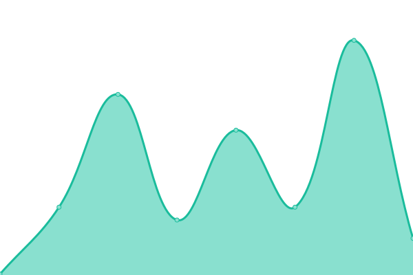

# [📈 Live Status](https://upptime.github.io/upptime): <!--live status--> **🟧 Partial outage**

This repository contains the open-source uptime monitor and status page for [Upptime](https://upptime.js.org), powered by [Upptime](https://github.com/upptime/upptime).

With [Upptime](https://upptime.js.org), you can get your own unlimited and free uptime monitor and status page, powered entirely by a GitHub repository. We use [Issues](https://github.com/upptime/upptime/issues) as incident reports, [Actions](https://github.com/upptime/upptime/actions) as uptime monitors, and [Pages](https://upptime.github.io/upptime) for the status page.

<!--start: status pages-->
<!-- This summary is generated by Upptime (https://github.com/upptime/upptime) -->
<!-- Do not edit this manually, your changes will be overwritten -->
<!-- prettier-ignore -->
| URL | Status | History | Response Time | Uptime |
| --- | ------ | ------- | ------------- | ------ |
|  [Action Sales](https://app.actionsales.com.ar) | 🟩 Up | [action-sales.yml](https://github.com/martin-levi/actionstatuspage/commits/HEAD/history/action-sales.yml) | 

 251ms
     
 | 

<a href="https://upptime.github.io/upptime/history/action-sales">100.00%</a>
    

|  [Action Route](https://route.actionsales.com.ar) | 🟥 Down | [action-route.yml](https://github.com/martin-levi/actionstatuspage/commits/HEAD/history/action-route.yml) | 

 0ms
     
 | 

<a href="https://upptime.github.io/upptime/history/action-route">0.01%</a>
    

|  [Action Api](https://api.actionsales.com) | 🟥 Down | [action-api.yml](https://github.com/martin-levi/actionstatuspage/commits/HEAD/history/action-api.yml) | 

 0ms
     
 | 

<a href="https://upptime.github.io/upptime/history/action-api">0.01%</a>
    

<!--end: status pages-->

[**Visit our status website →**](https://upptime.github.io/upptime)

## 📄 License

- Powered by: [Upptime](https://github.com/upptime/upptime)
- Code: [MIT](./LICENSE) © [Upptime](https://upptime.js.org)
- Data in the `./history` directory: [Open Database License](https://opendatacommons.org/licenses/odbl/1-0/)
